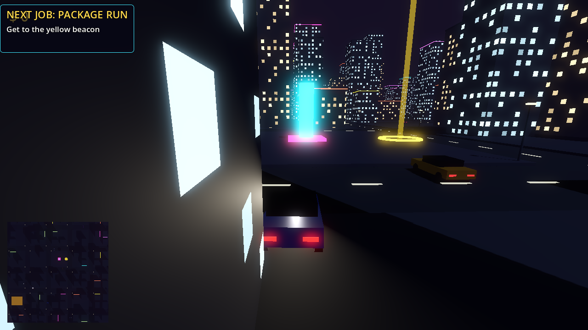
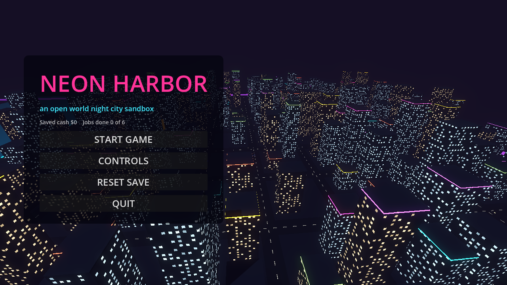
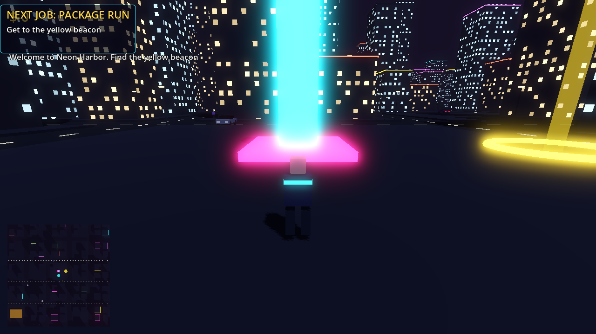
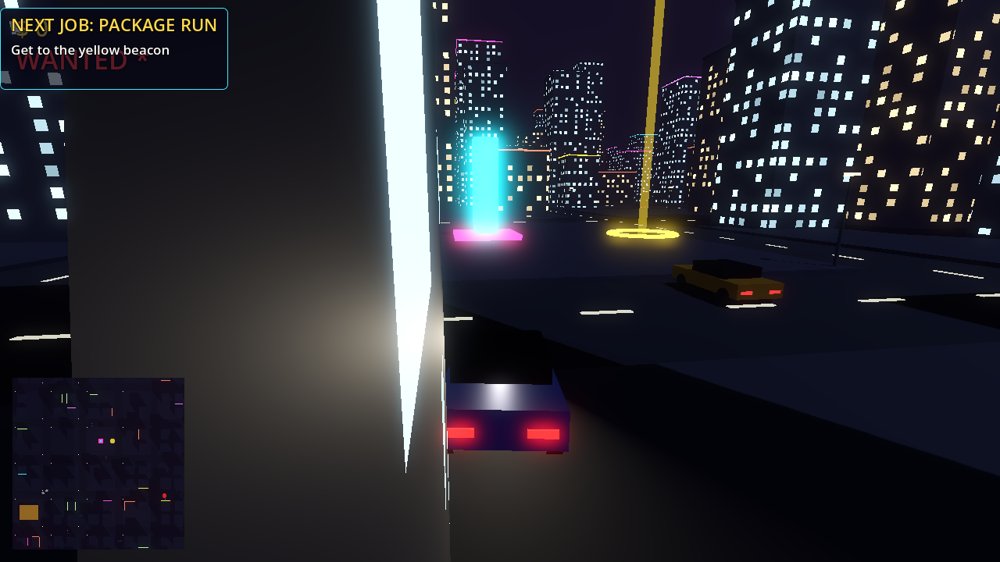

# Neon Harbor

An open world night city action game. Steal cars, outrun the police, run jobs
for cash, and own the harbor. Built with Godot 4.6 and exactly zero binary
assets: the whole city, every car, every texture and every sound is generated
from code at runtime.



## Download and play

Grab the latest build from the
[Releases page](../../releases/latest):

- **NeonHarborSetup.exe**: Windows installer, picks the right binary for your
  machine automatically (x64 and ARM64 are both included)
- **NeonHarbor-win-x64.exe**: portable, normal Intel or AMD PCs
- **NeonHarbor-win-arm64.exe**: portable, native for Snapdragon and other
  Windows-on-ARM devices

No install dependencies. Single file, double click, play.

## What is in the game

- A procedurally generated neon city: 100 blocks of towers with lit windows,
  neon rooftop trims, glowing storefront signs, street lights, parks, a plaza
  and a harbor waterfront
- Third person on-foot movement with sprint and jump
- Drivable cars with arcade vehicle physics, working headlights, horn and
  engine audio that follows the revs. Walk up to any parked or moving car and
  take it
- AI traffic that obeys the road grid, brakes for obstacles and honks when
  you wedge it in
- Pedestrians who stroll the sidewalks and scatter when things go wrong
- A five star wanted system: hit and runs and rammed cruisers raise the heat,
  police cars hunt you down and bust you if they corner you
- Six story missions: deliveries, a checkpoint race, a taxi fare, a car
  theft, a rooftop climb and a top speed challenge, then endless courier jobs
- Live minimap, cash, wanted stars, mission timers, pause menu, persistent
  save file
- A procedurally synthesized synthwave soundtrack and sound effects, all
  generated at startup from pure math





## Controls

| Action | Key |
| --- | --- |
| Move and drive | WASD or arrow keys, left stick on a gamepad |
| Camera | Mouse |
| Sprint | Shift |
| Jump | Space (on foot) |
| Handbrake | Space (driving) |
| Enter or exit a car | E |
| Horn | H |
| Toggle minimap | M |
| Pause | Esc |

## Build from source

1. Install [Godot 4.6.x](https://godotengine.org/download) (standard build,
   no Mono needed)
2. Clone this repository and open `project.godot` in the editor, or run
   `godot --path .` from the repository root
3. To export, install the matching export templates
   (Editor, Manage Export Templates) and run:

```
godot --headless --export-release "Windows x64" dist/NeonHarbor-win-x64.exe
godot --headless --export-release "Windows ARM64" dist/NeonHarbor-win-arm64.exe
```

The installer is built from `installer/neon_harbor.iss` with
[Inno Setup 6](https://jrsoftware.org/isinfo.php).

There are no imported assets to download: every mesh, texture and sound is
created procedurally when the game boots.

## Tech notes

- Engine: Godot 4.6.3, Forward Plus renderer, GDScript only
- The city is seeded, so every player walks the same streets
- Vehicle physics: `VehicleBody3D` with tuned wheel friction and a custom
  center of mass for arcade handling
- Audio: PCM synthesized into `AudioStreamWAV` buffers at startup, including
  an eight bar synthwave loop with pad chords, sub bass, kick and hats
- The game was developed and tested natively on a Windows-on-ARM laptop

## Disclaimer

Neon Harbor is an original work. It is not affiliated with, endorsed by, or
related to Rockstar Games or the Grand Theft Auto series in any way.

## License

[MIT](LICENSE)
