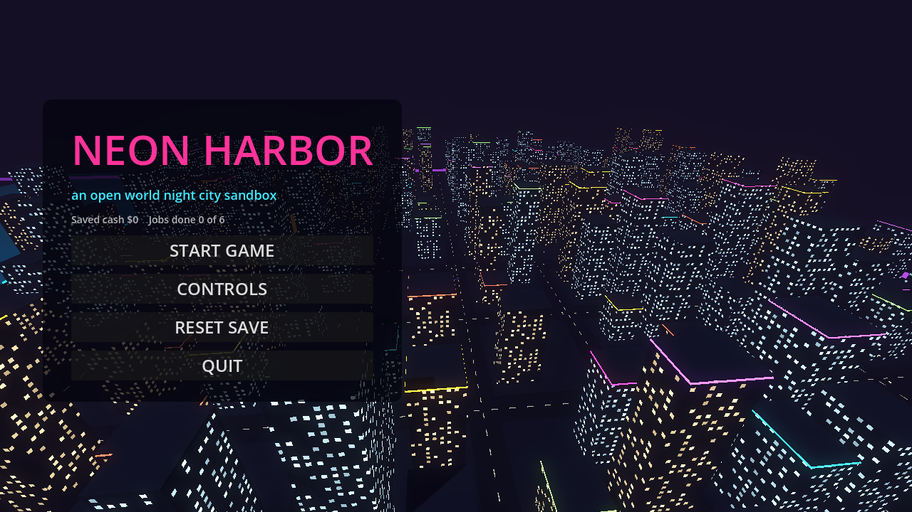
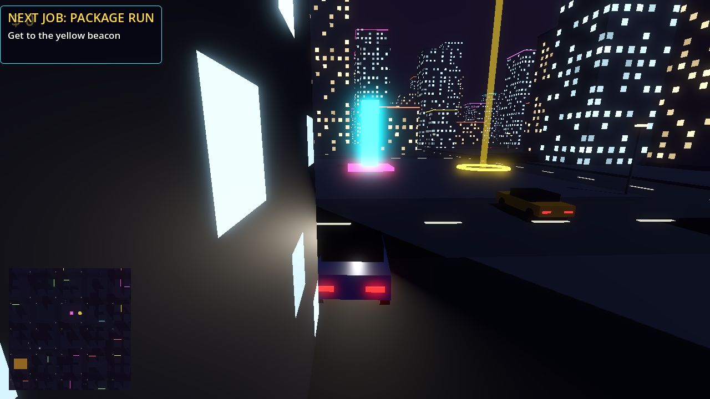
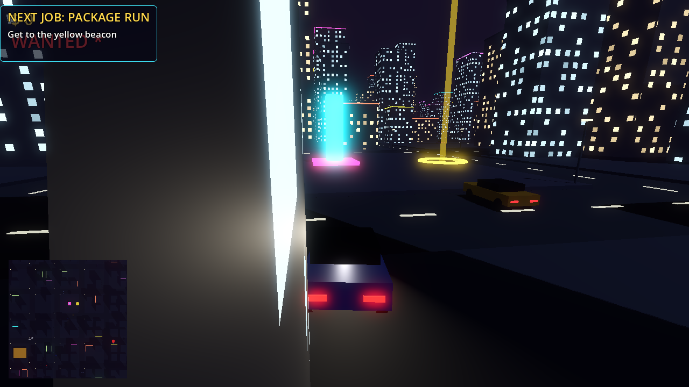

# NEON HARBOR

**An open world night city. Steal it one car at a time.**

A hundred blocks of neon towers, a harbor at the edge, and a police force with no sense of humor.
Take any car, run jobs for cash, push your luck to five stars. Every chase ends in chaos.

[](https://github.com/OutBlade/neon-harbor/releases/latest)
[](https://godotengine.org)
[](https://github.com/OutBlade/neon-harbor/releases/latest)

---

<p align="center">
  
</p>

<p align="center">
  
</p>

<p align="center">
  
</p>

---

## Features

- Procedurally generated neon city: 100 seeded blocks of towers with lit windows, neon rooftop trims, glowing signs, street lights, parks, a plaza and a harbor waterfront
- Third person on-foot movement with sprint and jump, walk up to any car and take it
- Arcade vehicle physics with working headlights, horn, handbrake and rev-following engine audio
- AI traffic that follows the road grid, brakes for obstacles and honks when wedged
- Pedestrians who stroll the sidewalks and scatter when things go wrong
- Five star wanted system: hit and runs raise the heat, cruisers hunt you down and bust you if they corner you
- Six story missions plus endless courier jobs once the campaign is done
- Live minimap, cash, mission timers, pause menu, persistent save file
- Procedural audio engine: the synthwave soundtrack and every sound effect are synthesized from pure math at startup
- Zero binary assets in the entire repository: every mesh, texture and sound is generated from code
- Native builds for both x64 and Windows-on-ARM

## Controls

| Input | Action |
|-------|--------|
| WASD / arrows / left stick | Move and drive |
| Mouse | Camera |
| Shift | Sprint |
| Space | Jump on foot, handbrake in a car |
| E | Enter or exit a car |
| H | Horn |
| M | Toggle minimap |
| Esc | Pause |

Longer jobs pay better. Stay out of the harbor.

## Missions

**Campaign:** Package Run, Neon Sprint, Night Cab, Hot Wheels, Rooftop Cache, Night Rider

**After the campaign:** endless Courier Runs with escalating pay

Find the yellow beacon to start a job, follow the cyan beacons to finish it.

## Run from source

```bash
# Godot 4.6.x standard build, no Mono needed
godot --path .          # run the game
godot -e --path .       # open in the editor
```

Every mesh, texture and sound is generated procedurally at boot, so there are no assets to import and no downloads beyond the engine itself.

## Build installer

```bash
godot --headless --export-release "Windows x64" dist/NeonHarbor-win-x64.exe
godot --headless --export-release "Windows ARM64" dist/NeonHarbor-win-arm64.exe
ISCC.exe installer/neon_harbor.iss     # Inno Setup 6
```

Output lands in `dist/`. The installer bundles both architectures and installs the native binary for the machine it runs on.

## Project structure

```
neon-harbor/
  project.godot            Engine config, autoload, rendering settings
  export_presets.cfg       Windows x64 and ARM64 export presets
  scenes/
    Main.tscn              Single entry scene, everything else is code
  scripts/
    Main.gd                Menus, session flow, world upkeep, autoshot mode
    Game.gd                Autoload: state, heat, input map, save data
    CityGen.gd             Procedural city: blocks, towers, signs, harbor
    Player.gd              On-foot character
    CameraRig.gd           Orbit camera with wall avoidance
    Car.gd                 Vehicle physics, enter and exit, lights, audio
    TrafficCar.gd          Grid-following civilian AI
    PoliceCar.gd           Pursuit AI, busts, light bar and siren
    Pedestrian.gd          Sidewalk AI, flee and ragdoll
    MissionManager.gd      Campaign and courier jobs, beacons
    HUD.gd                 Cash, stars, mission panel, minimap, toasts
    SoundBank.gd           Procedural PCM synthesis for all audio
  installer/
    neon_harbor.iss        Inno Setup script (x64 + ARM64 in one setup)
  docs/
    screenshots/           Captured by the built-in autoshot mode
```

Run the game with `-- --autoshot` and it plays itself and saves fresh screenshots to `shots/`.

## License

MIT

Neon Harbor is an original work, not affiliated with Rockstar Games or the Grand Theft Auto series.
